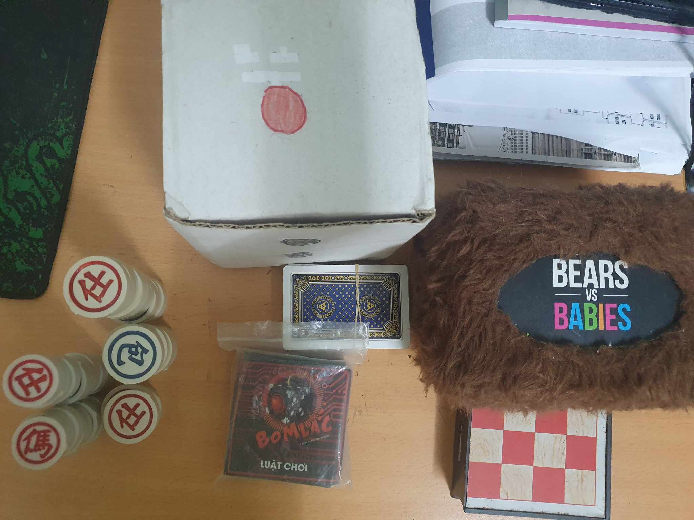
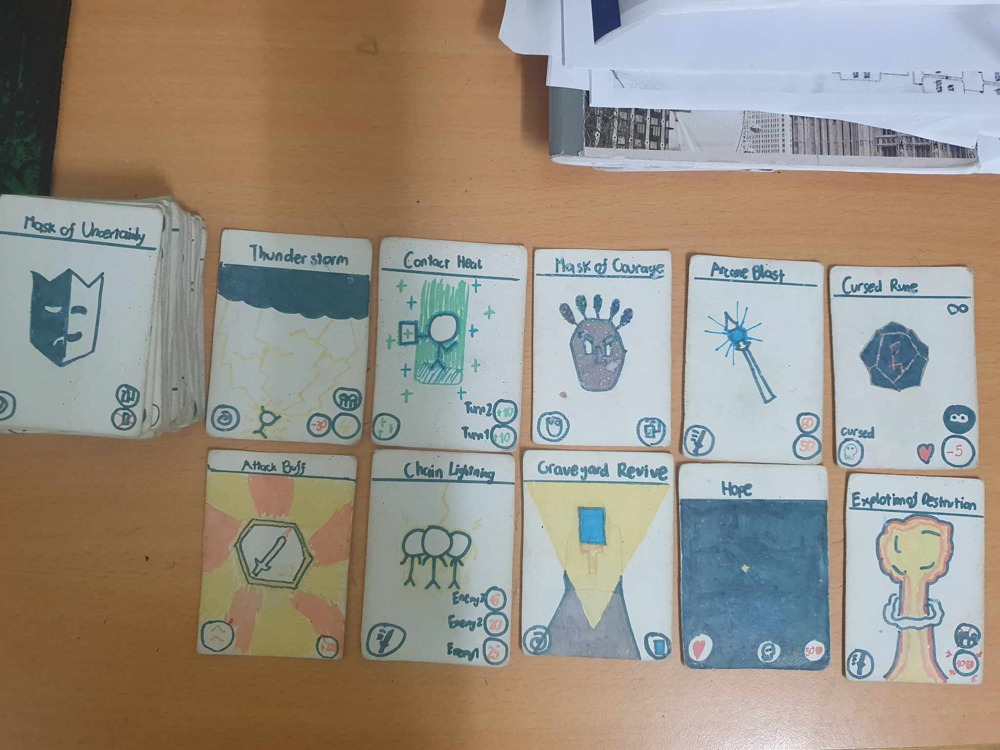
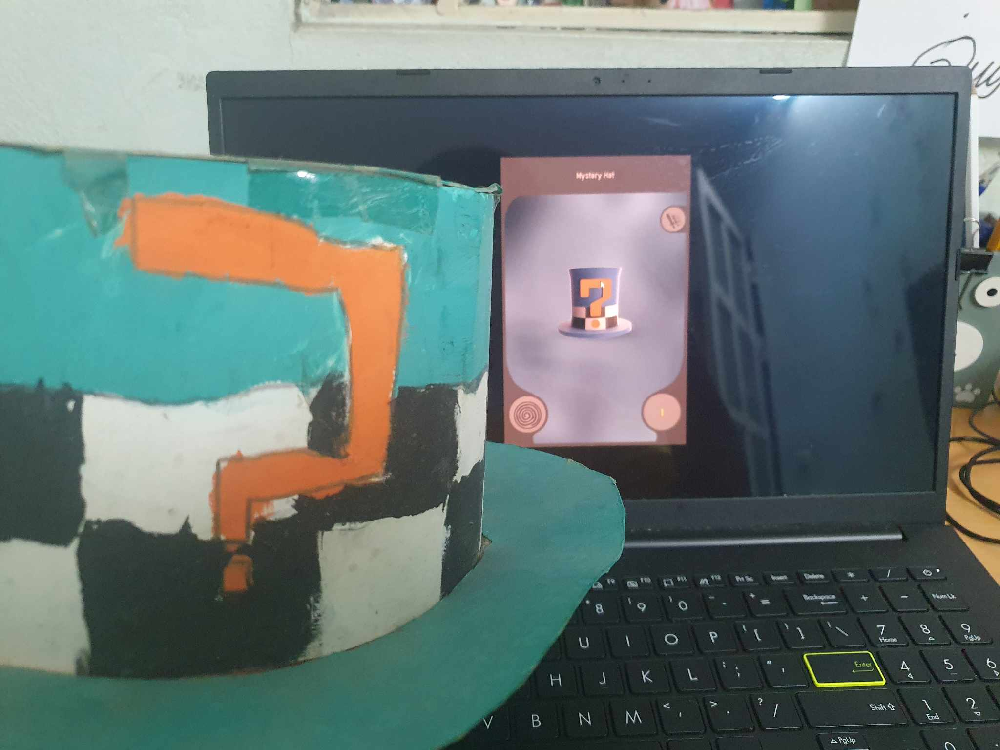
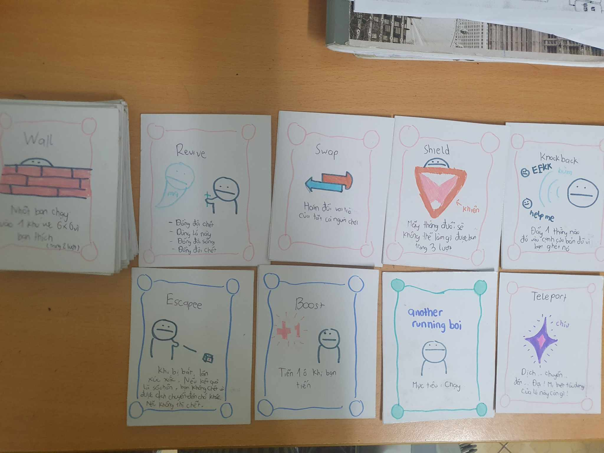
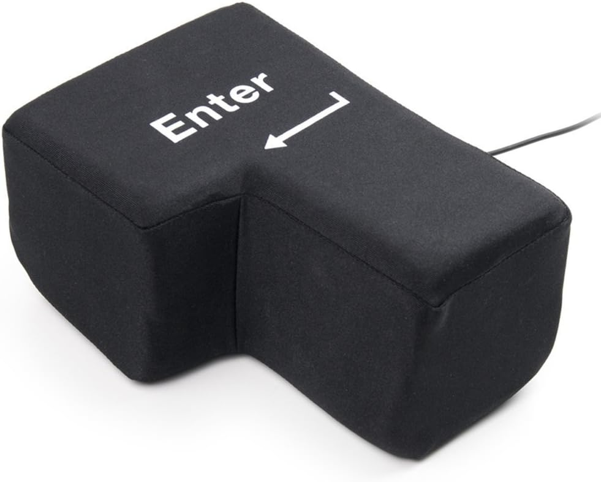

## Who am I?
Hello, my name is An. 

I am residing in Hanoi, Vietnam and a student majoring Physics of Hanoi - Amsterdam High School for the Gifted. 

## My interests
### Informatics
My interest in Informatics started when I was 13 years old. My brother introduced me to a Python bootcamp course on Udemy. After some hours of watchtime, I had made a great discovery: The everyday computers could do pretty much anything we told them to. 

Intrigued, I continued studying and made amazing progress: I knew how to use different data structures, solved simple problems, and made a few games. It feels awesome having your programs run perfectly so I kept going.

After completing the course, I still felt unsatisfied so I continued to scour YouTube for interesting Python tutorials that weren't covered in the course. I was able to pump out some small projects, notably my text-based Durak game and a knock-off version of Notepad.

<iframe width="560" height="315" src="https://www.youtube.com/embed/uwTAmwCsv1c" title="YouTube video player" frameborder="0" allow="accelerometer; autoplay; clipboard-write; encrypted-media; gyroscope; picture-in-picture; web-share" allowfullscreen></iframe>

During high school, my friends from Informatics class suggested I should dive into Algorithm. Once again, I was taken aback by this: These are the stepping stones to build up complex algorithms that make up the technology around us, something I have always taken for granted. Having unlocked this divine knowledge, I immediately started doing research and studied every day.

Initially, my parents disapproved of this, seeing how I drifted away from my main major. But after some talks and convincing, they gave in and allowed me to continue studying Informatics. With encouragement from my family as well as help from classmates and alumni, I continue to delve into Algorithm and am still learning new things every day.

### Tabletop Games
I have always been fond of board games ever since I was little. I'm a homebody so it's hard for me to stir up any conversations. I've found board games as an easier alternative, for homebodies like me, to connect to people, whether it be funny moments or teamwork against adversaries. Tabletop games have helped me make a lot of close friends, some are still close to me today.

Not only that, I also took a step further by making my own tabletop games. Although it took a long time to finish them, these games were well-received by my friends, making them worth the effort.

### A giant Enter key

No further explanations are needed.